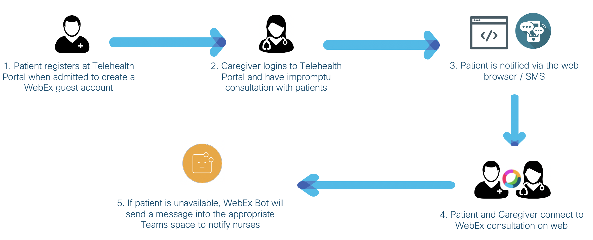

# Webex Telehealth Portal

A full stack solution to enable Webex meeting services fully on web for healthcare use case. There are three main use cases:
1. In-Patient Consultation (Impromptu) & Bot Notification for Unavailable Patients
2. Out-Patient Consultaion (Scheduling)
3. Virtual Guest Visit

---

The following diagram describes the high-level workflow.

1. In-Patient Consultation & Bot Notification


2. Out-Patient Consultation


3. Virtual Guest Visit


## Contacts
* Alvin Lau (alvlau@cisco.com)
* Monica Acosta (moacosta@cisco.com)
* Sunjay Mandhan (sumandha@cisco.com)


## Solution Components
* Webex (SDK, Guest Issuer and Bot)
* MongoDB (version 4.2.6)
* NodeJS (version 12.16.3 or later; dependencies listed in package.json)


## Prerequisite
- **Webex Guest Issuer App** - You can set it up at [Webex Guest Issuer Guide](https://developer.webex.com/docs/guest-issuer).

- **Webex Bot** - You can set it up at [Webex Bot Guide](https://developer.webex.com/docs/bots).

- **MongoDB** - if you do not have a MongoDB setup, you can go to [MongoDB website](https://www.mongodb.com/) and create a free account. Then you should follow along the instructions in MongoDB site. Once you finish setting up the cluster, follow the below steps to obtain integration essentials.
  1. Click "Connect" -> "Connect your application".
  2. Make sure driver is "Node.js" and version is "3.0 or later".
  3. Copy the connection string and replace <password> and <dbname> accordingly.

- **Data in MongoDB assuming they are imported from Patient Management System / Active Directory**
  1. Create three collections namely "Caregiver", "Patient" and "Outpatient".
  2. Create a user in "Caregiver" for login, with schema:
  ```
  {
    name: "CaregiverName",
    username: "CaregiverUsername",
    password: "CaregiverPassword",
    person_id: "WebexPersonId",
    access_token: "WebexAccessToken"
  }
  ```
  - OAuth is not set in this prototype
  3. Create a patient in "Patient", with schema:
  ```
  {
    name: "PatientName",
    medical_id: "PatientMedicalId",
    location: "PatientLocation",
    (optional)phone: "PatientPhone"
  }
  ```
  4. Create an outpatient in "Outpatient", with schema:
  ```
  {
    name: "PatientName",
    medical_id: "PatientMedicalId",
    contact: "PatientContact(SMS/Email)"
  }
  ```

- **ngrok / Heroku** - free HTTPS server services. Required for Webex SDK to work. For ngrok, follow the [ngrok download page](https://ngrok.com/download) to set it up. For Heroku, follow [Heroku Getting Started Guide](https://devcenter.heroku.com/articles/getting-started-with-nodejs) to start using their services.

- **Twilio** - SMS service. Notification for patients. Visit [Twilio](https://www.twilio.com/sms) to set it up.

- **Gmail** - email service used in this project. Register an account at Google.


## Installation

1. Clone this repository by `git clone <this repo>`.

2. Update all the environmental variables in the two ".env" files under "/telehealth-portal" and "/telehealth-bot".

3. Install and run Telehealth Portal.
```
cd telehealth-portal
npm install
npm start
```
   - Alternatively, host the Telehealth Portal on Heroku following instructions in Heroku
   - Visit https://<host>/caregiver for Caregiver Telehealth Portal
   - Visit https://<host>/patient/register for Patient Telehealth Portal


4. Install and run Telehealth Bot.
```
cd telehealth-bot
npm install
npm start
```
   - Alternatively, host the Telehealth Portal on Heroku following instructions in Heroku
   - The bot needs to be reachable by Webex Cloud


## License
Provided under Cisco Sample Code License, for details see [LICENSE](./LICENSE)


## Code of Conduct
Our code of conduct is available [here](./CODE_OF_CONDUCT.md)


## Contributing
See our contributing guidelines [here](./CONTRIBUTING.md)


## Credits
Webex Guest Issuer part is taking [this Cisco repo](https://github.com/gve-sw/WebexJSSDKGuestSingleCallSharingSample) as reference. For more information, please check [Webex Guest Issuer Guide](https://developer.webex.com/docs/guest-issuer).

Webex Bot part is built on top of [this Cisco repo](https://github.com/CiscoDevNet/botkit-webex-samples). For more information, please check [Webex Bot Guide](https://developer.webex.com/docs/bots).
